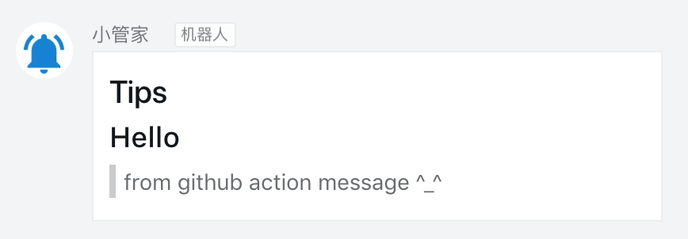

# Dingtalk robot action


Github action for sending dingtalk robot messages

## ✨ Example Usage

```yml
- name: dingtalk robot message
uses: fifsky/dingtalk-action@master
with:
  url: ${{ secrets.DINGTALK_WEBHOOK}}
  type: markdown
  content: |
    # Tips
    ## Hello
    > from github action message
    > ^_^
```

🔐 Set your secrets here: `https://github.com/USERNAME/REPO/settings/secrets`.

> The url parameter is the full address of dingtalk robot:
> https://oapi.dingtalk.com/robot/send?access_token=xxxxxx

**Result**



## Options

| option | type | required | default | description |
| --- | --- | --- | --- | --- |
|  url | string | Yes | none | The full address of dingtalk robot: https://oapi.dingtalk.com/robot/send?access_token=xxxxxx |
| type | string | No | text | Dingtalk message type，support (text,markdown,custom) |
| content | string | Yes | none |  Message content, text or markdown or json string |
| at | string | No | none | At user,Use commas to separate, for example: 13812345678,13898754321 |

if type is custom, content is dingtalk api json request body,for example

> content: {"msgtype": "text", "text": {"content": "我就是我, 是不一样的烟火"}}

## Dingtalk robot document

https://ding-doc.dingtalk.com/doc#/serverapi2/qf2nxq